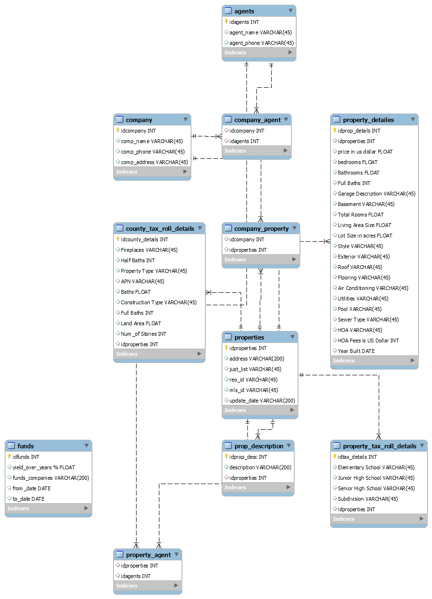

# USA Real estate scraping
## Inbal Agur & Ron Levy & Ohad Hayoun
Scraping real estate data from USA government agencies has never beem more easy.

# Table of Content
* [General info](#general-info)
* [Technologies](#technologies) 
* [Pre-Launch](#pre-launch)
* [Launch](#Launch)
* [Database](#Database)

# General info
Real estate data can be powerful way to make smart decisions in both international and domestic market. This script allows you to achive huge amount of data very easily. the data is taken from the following site: https://www.homepath.com/

# Technologies
To run this code, please use Python 3.x.
We used Chrome webdriver for this project, so please download Chrome you you don't have it yet.
You can download the webdriver from this address: https://chromedriver.chromium.org/downloads

Please make sure you have the following packages:
* beautifulsoup4~=4.9.3
* selenium~=3.141.0
* mysql-connector-python~=8.0.21

# Pre-Launch
* Create a file with `database name, database path, SQLhost, SQLuser, SQLpassword, WebDriver Path`. 
# Launch
* Insert ```places LimitResults``` parameters
* ```places``` are the locations you're looking for. for multiple places, please separate inputs by space
* Default `place`: new-york
* Default search limit: `Unlimited`
 
# Database
The database is made of the following tables:
* _agents_ - Real-estates agents who sale the properties in the databse
_* company_ - The companies where the real-estate agents works
* _county_tax_roll_details_ - County details about the properties
* _prop_description'_ - Description about the property
* _properties_ - a table of all properties. This table auto increment id is a foreign key for al tables
* _property_detailes_ - Morre details about the propery
* _property_tax_roll_details_ - Tax details about the property

## ERD

